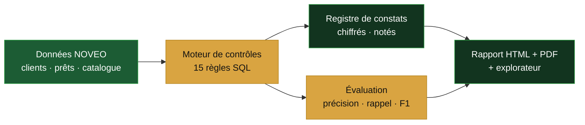

<div align="center">

# INSPECTION DATA

**Simulation d'une mission d'inspection Data sur une banque de détail fictive**

_Qualité · Gouvernance · Protection des données — cadrage, investigations, débriefing_

<p>
  
  
  
</p>

<p>
  
  
  
  
  
  
</p>

<a href="https://inspection-data.vercel.app"><strong>Voir la démo en ligne »</strong></a>

</div>

---

## Le projet

**INSPECTION DATA** rejoue une mission d'inspection Data de bout en bout sur **NOVEO Banque**, un établissement de détail fictif. L'objet audité : la **chaîne de données du risque de crédit** (clients et prêts). La démarche suit les trois étapes d'une vraie mission d'Inspection Générale : **cadrage**, **investigations**, **débriefing**.

Le projet ne construit pas un dispositif de gouvernance : il l'**inspecte**. Il révèle les failles, les chiffre, les note par niveau de risque et produit un registre de constats avec recommandations.

> **En une phrase :** j'ai simulé une mission d'inspection Data complète, avec un moteur de contrôles fiable et mesuré, un rapport d'inspection automatisé et un explorateur de données transparent.

---

## Principe technique

Les contrôles sont des **règles métier déterministes** (SQL). C'est le code qui détecte, compte et note ; aucune interprétation par un modèle. Résultat : des conclusions **traçables, reproductibles et auditables**. Un jeu de test à vérité terrain mesure la fiabilité du moteur avant tout usage sur données réelles.



---

## Les trois piliers couverts

| Pilier | Contrôles | Référentiel |
|---|---|---|
| **Qualité** | complétude, bornes, cohérence temporelle, unicité, fraîcheur, validité du statut, intégrité référentielle | BCBS 239 |
| **Gouvernance** | propriété (Data Owner), traçabilité (lineage), conformité au référentiel, classification de sensibilité | DAMA-DMBOK |
| **Protection** | consentement RGPD, durée de rétention, rétention des PII, traçabilité des PII | RGPD |

---

## Résultats

| Indicateur | Valeur |
|---|---|
| Contrôles exécutés | **15** (11 non conformes, 4 conformes) |
| Anomalies détectées | **206 / 206** injectées |
| Précision · Rappel · F1 | **1.00 · 1.00 · 1.00** |

Un F1 de 1.00 ne dit pas que les données sont parfaites : il prouve que les **règles de contrôle sont écrites correctement** (aucune fausse alerte, aucun oubli) sur un jeu de référence, avant application au réel. La démarche de passage aux données réelles (challenge des métiers, échantillonnage, réconciliation, détection statistique d'anomalies) est détaillée directement dans le rapport.

---

## Ce que contient le rapport

- **Synthèse** de mission : constats par criticité, taux de conformité, fiabilité du moteur.
- **Registre des constats** : pour chaque contrôle, ce qu'il vérifie, pourquoi c'est important, le constat chiffré et la recommandation.
- **Explorateur de données** : parcours des prêts, clients et catalogue de données, avec les lignes en anomalie surlignées et rattachées au contrôle qui les a signalées.
- **Section fiabilité** : le score F1 expliqué de zéro (VP / FP / FN, formules, exemple chiffré).
- **Passage aux données réelles** : comment la démarche transpose sur du réel.

Le rapport est **généré automatiquement** en HTML (thème sombre vert/or) et en PDF, et peut être régénéré à chaque exécution.

---

## Stack technique

- **Données & moteur :** Python 3.12, pandas, DuckDB (SQL), Faker
- **Restitution :** HTML / CSS / JS statique, IBM Plex, graphiques SVG, rapport PDF via Playwright
- **Base cible :** schéma Postgres fourni (`sql/schema_supabase.sql`)
- **Automatisation :** GitHub Actions (exécution et rapport programmés)
- **Déploiement :** Vercel (site statique)

---

## Structure du dépôt

```text
inspection-data/
├── generate_noveo.py        # données synthétiques + défauts injectés + vérité terrain
├── controls.py              # 15 contrôles (règles SQL)
├── evaluate.py              # précision / rappel / F1 vs vérité terrain
├── run.py                   # orchestrateur → site, registre, PDF
├── report_pdf.py            # génération du rapport PDF (Playwright)
├── requirements.txt
├── sql/
│   └── schema_supabase.sql  # schéma Postgres (chargement)
├── web/
│   ├── index.html           # rapport + explorateur
│   ├── findings.js          # généré par run.py
│   └── data.js              # généré par run.py
├── reports/                 # rapport_inspection.pdf (généré)
└── .github/workflows/
    └── inspection.yml        # exécution + rapport automatiques
```

---

## Lancer en local

```powershell
python -m venv .venv
.\.venv\Scripts\Activate.ps1
pip install -r requirements.txt

# pour le rapport PDF
pip install playwright
python -m playwright install chromium

# génère le site, le registre et le PDF
python run.py --pdf
Start-Process .\web\index.html
```

`python run.py` seul génère uniquement le site (`web/findings.js`, `web/data.js`, `data/registre.csv`). L'option `--pdf` ajoute le rapport PDF dans `reports/`.

---

## Déploiement (Vercel)

Site statique servi depuis `web/` : sur Vercel, importer le dépôt, régler **Root Directory** sur `web`, **Framework Preset** sur `Other`, sans build command. Chaque `git push` sur `main` redéploie automatiquement.

---

## Contexte

Projet de pour un poste d'**Inspecteur Data** en environnement bancaire régulé. Les données sont **entièrement synthétiques** ; aucune donnée réelle ni personnelle n'est utilisée.

<div align="center">
<sub>Réalisé par <a href="https://heykelhachiche.com">Heykel Hachiche</a> · <a href="https://github.com/heykelh">github.com/heykelh</a></sub>
</div>
